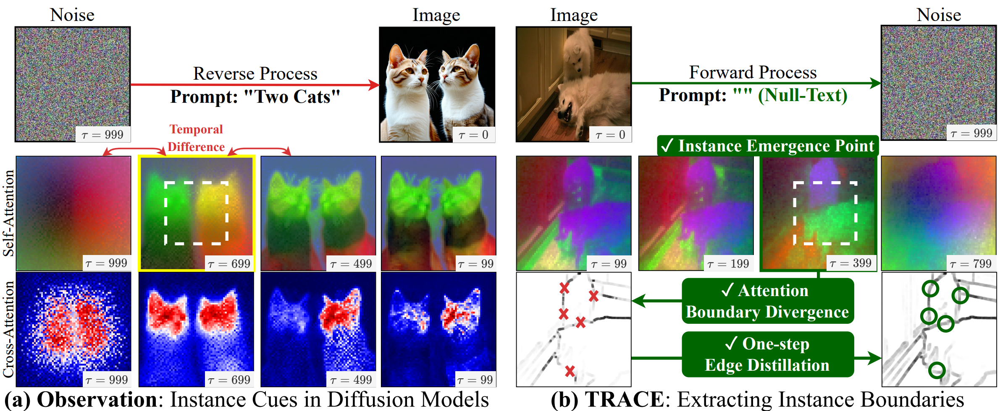
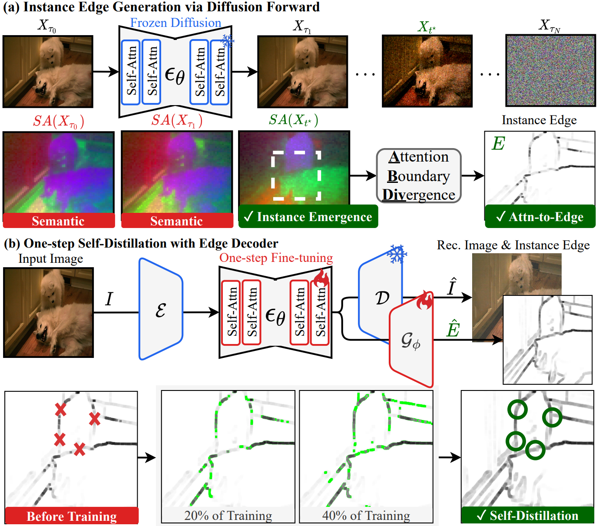

<div align="center">

# TRACE: Your Diffusion Model Is Secretly an Instance Edge Detector

### ⭐ ICLR 2026 Oral Presentation (Top 1.18%, 223/18,862)

[](https://shjo-april.github.io/TRACE)
[](https://openreview.net/pdf?id=BjElYlJKMj)
[](https://openreview.net/forum?id=BjElYlJKMj)
[](https://arxiv.org/abs/2503.07982)

[Sanghyun Jo](https://shjo-april.github.io/)<sup>1*</sup>, [Ziseok Lee](https://ziseoklee.github.io/)<sup>2*</sup>, [Wooyeol Lee](https://thisiswooyeol.github.io/)<sup>2</sup>, [Jonghyun Choi](https://ppolon.github.io/)<sup>2</sup>, [Jaesik Park](https://jaesik.info/)<sup>2†</sup>, [Kyungsu Kim](https://aibl.snu.ac.kr/team/pi-information)<sup>2†</sup>

<sup>1</sup>OGQ &nbsp;&nbsp; <sup>2</sup>Seoul National University  
<sup>*</sup>Equal contribution &nbsp;&nbsp; <sup>†</sup>Corresponding authors

</div>

---

> **🚧 Code, pretrained models, and presentation materials will be released in April 2026. Please stay tuned!**  
> If you'd like to be notified, please **⭐ star** this repository and **👁️ watch** for updates.

---

<div align="center">

| +5.1 AP | +7.1 PQ | 81× Faster | 0.889 ODS |
|:---:|:---:|:---:|:---:|
| Unsupervised Instance Seg. | Tag-supervised Panoptic Seg. | One-step Distillation | Instance Edge Quality |
| COCO | VOC 2012 | 45ms / image | 2× over best baseline |

</div>

## 💡 TL;DR

Text-to-image diffusion models **secretly encode instance boundaries** in their self-attention maps during denoising. **TRACE** (**TRA**nsforming diffusion **C**ues to instance **E**dges) decodes these hidden cues into sharp instance edges **without any annotations, prompts, points, boxes, or masks**, enabling annotation-free instance and panoptic segmentation that surpasses point-supervised baselines.

<div align="center">
  
</div>

## 📢 News

- **[2026.02]** 🎉 TRACE is selected as an **Oral Presentation** at **ICLR 2026** (only 223 papers, 1.18% acceptance rate).
- **[2026.01]** ✅ TRACE is accepted to **ICLR 2026**.
- **[2025.03]** 📄 Preprint available on [arXiv](https://arxiv.org/abs/2503.07982).

## 🔍 Overview

<div align="center">
  
</div>

TRACE reveals that self-attention in pretrained text-to-image diffusion models briefly yet reliably captures instance-level structure during the denoising process. Our framework consists of three stages:

**1. Instance Emergence Point (IEP)** identifies the exact timestep where instance boundaries first emerge in self-attention maps by maximizing inter-step KL divergence.

**2. Attention Boundary Divergence (ABDiv)** is a non-parametric score that converts instance-aware self-attention into edge maps by measuring criss-cross divergence between opposite neighbors.

**3. One-Step Self-Distillation** distills pseudo edge maps into a lightweight decoder via LoRA fine-tuning, enabling single-pass inference (3,682ms → 45ms, **81× speedup**) while improving edge connectivity.

## 📊 Main Results

### Unsupervised Instance Segmentation

| Method | VOC 2012 | COCO 2014 | COCO 2017 |
|:---|:---:|:---:|:---:|
| MaskCut | 5.8 | 3.0 | 2.3 |
| + **TRACE** | **9.7** (+3.9) | **7.9** (+4.9) | **7.5** (+5.2) |
| ProMerge | 5.0 | 3.1 | 2.5 |
| + **TRACE** | **9.4** (+4.4) | **8.2** (+5.1) | **7.8** (+5.3) |
| CutLER | 11.2 | 8.9 | 8.7 |
| + **TRACE** | **14.8** (+3.6) | **13.1** (+4.2) | **12.8** (+4.1) |

### Weakly-supervised Panoptic Segmentation

| Method | Supervision | VOC PQ | COCO PQ |
|:---|:---:|:---:|:---:|
| Point2Mask (Swin-L) | Point | 61.0 | 37.0 |
| EPLD (Swin-L) | Point | 68.5 | 41.0 |
| DHR + **TRACE** (Swin-L) | **Tag only** | **69.8** | **43.1** |
| Mask2Former (ResNet-50) | Full mask | 73.6 | 51.9 |

> With **only image-level tags**, TRACE+DHR surpasses point-supervised methods on both VOC and COCO.

### Diffusion vs. Non-Diffusion Backbones

| Backbone | Type | Params | AP<sup>mk</sup> |
|:---|:---:|:---:|:---:|
| Qwen2.5-VL | Non-Diffusion | 72B | 4.1 |
| DINOv3 | Non-Diffusion | 7.0B | 4.3 |
| PixArt-α | **Diffusion** | **0.6B** | **7.1** |
| SD3.5-Large | **Diffusion** | 8.1B | **8.2** |
| FLUX.1 | **Diffusion** | 12B | **8.3** |

> Even the smallest diffusion model (0.6B) significantly outperforms 72B non-diffusion models, confirming that TRACE leverages the unique generative nature of diffusion.

### Instance Edge Quality

| Method | ODS | OIS | clDice |
|:---|:---:|:---:|:---:|
| Canny | 0.129 | 0.202 | 0.134 |
| HED | 0.347 | 0.443 | 0.446 |
| PiDiNet | 0.362 | 0.450 | 0.574 |
| DiffusionEdge | 0.428 | 0.485 | 0.576 |
| **TRACE** | **0.889** | **0.899** | **0.826** |

## 🛠️ Installation

> ⏳ Coming in April 2026.

```bash
# Clone the repository
git clone https://github.com/shjo-april/TRACE.git
cd TRACE

# Create conda environment
conda create -n trace python=3.10 -y
conda activate trace

# Install dependencies
pip install -r requirements.txt
```

### Requirements

- Python ≥ 3.10
- PyTorch ≥ 2.1
- CUDA ≥ 11.8
- Single NVIDIA A100 GPU (32GB VRAM for SD3.5-L)

## 🚀 Quick Start

> ⏳ Coming in April 2026.

### 1. Generate Instance Edges (Training-Free)

```bash
# Extract instance edges from a single image
python trace_infer.py \
    --image_path ./examples/input.jpg \
    --backbone sd3.5-large \
    --output_dir ./outputs
```

### 2. One-Step Self-Distillation

```bash
# Train the edge decoder on ImageNet
python trace_train.py \
    --backbone sd3.5-large \
    --dataset imagenet \
    --lora_rank 64 \
    --epochs 10
```

### 3. Apply to Downstream Tasks

```bash
# Unsupervised Instance Segmentation (with ProMerge)
python eval_uis.py \
    --baseline promerge \
    --trace_ckpt ./checkpoints/trace_sd35l.pth \
    --dataset coco2014

# Weakly-supervised Panoptic Segmentation (with DHR)
python eval_wps.py \
    --baseline dhr \
    --trace_ckpt ./checkpoints/trace_sd35l.pth \
    --dataset voc2012
```

## 📁 Model Zoo

> ⏳ Coming in April 2026.

| Backbone | Dataset | AP<sup>mk</sup> (COCO) | Download |
|:---|:---:|:---:|:---:|
| SD 1.5 | ImageNet | 6.8 | Coming Soon |
| SDXL | ImageNet | 7.4 | Coming Soon |
| SD3.5-Large | ImageNet | 8.2 | Coming Soon |

## 📂 Project Structure

```
TRACE/
├── configs/               # Configuration files
├── datasets/              # Dataset loaders
├── models/
│   ├── backbone/          # Diffusion backbone wrappers
│   ├── decoder/           # Edge decoder (Gϕ)
│   └── trace.py           # TRACE main module (IEP + ABDiv)
├── tools/
│   ├── bgp.py             # Boundary-Guided Propagation
│   └── visualize.py       # Visualization utilities
├── trace_train.py         # One-step self-distillation training
├── trace_infer.py         # Inference script
├── eval_uis.py            # UIS evaluation
├── eval_wps.py            # WPS evaluation
├── requirements.txt
└── README.md
```

## 📖 Citation

If you find TRACE useful in your research, please consider citing:

```bibtex
@inproceedings{jo2026trace,
  title     = {{TRACE}: Your Diffusion Model Is Secretly an Instance Edge Detector},
  author    = {Jo, Sanghyun and Lee, Ziseok and Lee, Wooyeol and Choi, Jonghyun and Park, Jaesik and Kim, Kyungsu},
  booktitle = {International Conference on Learning Representations (ICLR)},
  year      = {2026},
  note      = {Oral Presentation}
}
```

## 📜 License

This project is released under the [Apache 2.0 License](./LICENSE).
